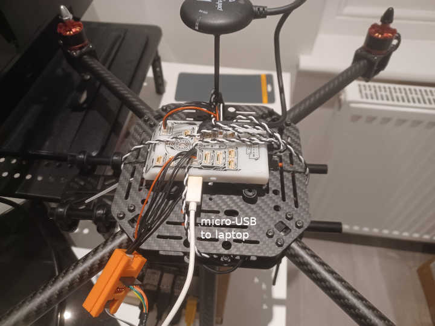

Jetson Nano & PX4/Pixhawk
____________________________________________________

This section provides an example on how to run GISNav on a Jetson Nano in a PX4 HIL simulation on a Pixhawk board. The
example adds a simulated ROS camera to the default PX4 Gazebo ``iris_hitl`` model. The example also assumes you have a
`NXP FMUK66-E board`_, but it should be adaptable to any `PX4 supported board`_.

.. _NXP FMUK66-E board: https://docs.px4.io/main/en/flight_controller/nxp_rddrone_fmuk66.html
.. _PX4 supported board: https://px4.io/autopilots/

.. warning::
    Keep the propellers **off** your drone throughout the HIL simulation.

Prerequisites
^^^^^^^^^^^^^^^^^^^^^^^^^^^^^^^^^^^^^^^^^^^^^^^^^^^
* Connect your Jetson Nano to your desktop (simulation host) computer via Ethernet cable (see :ref:`Onboard computer`
  for more information).
* Connect your Pixhawk board to your desktop (simulation host) computer via USB cable.
* Connect your Pixhawk board to your Jetson Nano via TELEM2 (set PX4 ``XRCE_DDS_0_CFG`` parameter to 102)
* Install a bootloader on your Pixhawk board if your board does not yet have one. See your board manufacturer's
  instructions on how to load one onto your specific board.
* (1) Install the `https://github.com/hmakelin/PX4-Autopilot.git`_ custom fork of PX4-Autopilot which includes
  required modifications to the microDDS bridge ``dds_topics.yaml`` configuration file, or (2) configure the bridge
  yourself (see :ref:`PX4-ROS 2 bridge topic configuration`).

  .. _https://github.com/hmakelin/PX4-Autopilot.git: https://github.com/hmakelin/PX4-Autopilot.git

.. note::
    In this example we have powered both the Pixhawk and Jetson Nano boards from the desktop computer via USB for
    convenience and to avoid having to handle LiPo batteries (fire hazard). In a more realistic setup you would supply
    power to both boards from the onboard battery.

    NXP FMUK66-E (FMU) board connected to laptop via micro-USB and to Jetson Nano via TELEM2 (IR/TLM2). Other wires as
    per `manufacturer's instructions`_, except for missing telemetry radio. FMU draws power from laptop via micro-USB,
    and Jetson Nano from wall socket via dedicated micro-USB DC adapter, so no LiPo batteries needed. Connection to
    from FMU to Jetson Nano via IR/TLM2 using USB to UART converter. See `FMUK66-E revision C pin layout`_ for
    how to wire the 4-pin IR/TLM2 JST-GH connector.

    .. _manufacturer's instructions: https://nxp.gitbook.io/hovergames/userguide/assembly/connecting-all-fmu-wires
    .. _FMUK66-E revision C pin layout: https://nxp.gitbook.io/hovergames/rddrone-fmuk66/connectors/telemetry-2#rddrone-fmuk66-rev.-c-schematic

Upload PX4 firmware
^^^^^^^^^^^^^^^^^^^^^^^^^^^^^^^^^^^^^^^^^^^^^^^^^^^
See the `PX4 uploading firmware instructions`_ for how to upload your development version of PX4 onto your Pixhawk
board. To find the ``make`` target for your specific board, list all options with the ``make list_config_targets``
command:

.. _PX4 uploading firmware instructions: https://docs.px4.io/main/en/dev_setup/building_px4.html#uploading-firmware-flashing-the-board

.. code-block:: bash

    cd ~/PX4-Autopilot
    make list_config_targets

The output will look like the following:

.. code-block:: text
    :caption: Example output of ``make list_config_targets`` command

    hmakelin@hmakelin-Nitro-AN515-54:~/PX4-Autopilot$ make list_config_targets
    airmind_mindpx-v2[_default]
    ark_can-flow_canbootloader
    ark_can-flow[_default]
    ark_can-gps_canbootloader
    ark_can-gps[_default]
    ark_cannode_canbootloader
    ark_cannode[_default]
    ark_can-rtk-gps_canbootloader
    ark_can-rtk-gps_debug
    ark_can-rtk-gps[_default]
    ark_fmu-v6x_bootloader
    ark_fmu-v6x[_default]
    atl_mantis-edu[_default]
    av_x-v1[_default]
    beaglebone_blue[_default]
    bitcraze_crazyflie21[_default]
    bitcraze_crazyflie[_default]
    cuav_can-gps-v1_canbootloader
    cuav_can-gps-v1[_default]
    cuav_nora_bootloader
    cuav_nora[_default]
    cuav_x7pro_bootloader
    cuav_x7pro[_default]
    cuav_x7pro_test
    cubepilot_cubeorange_bootloader
    cubepilot_cubeorange[_default]
    cubepilot_cubeorange_test
    cubepilot_cubeyellow[_default]
    cubepilot_io-v2[_default]
    diatone_mamba-f405-mk2[_default]
    emlid_navio2[_default]
    flywoo_gn-f405[_default]
    freefly_can-rtk-gps_canbootloader
    freefly_can-rtk-gps[_default]
    holybro_can-gps-v1_canbootloader
    holybro_can-gps-v1[_default]
    holybro_durandal-v1_bootloader
    holybro_durandal-v1[_default]
    holybro_kakutef7[_default]
    holybro_kakuteh7_bootloader
    holybro_kakuteh7[_default]
    holybro_pix32v5[_default]
    matek_gnss-m9n-f4_canbootloader
    matek_gnss-m9n-f4[_default]
    matek_h743_bootloader
    matek_h743[_default]
    matek_h743-mini_bootloader
    matek_h743-mini[_default]
    matek_h743-slim_bootloader
    matek_h743-slim[_default]
    modalai_fc-v1[_default]
    modalai_fc-v2_bootloader
    modalai_fc-v2[_default]
    modalai_voxl2[_default]
    modalai_voxl2-io[_default]
    modalai_voxl2-slpi[_default]
    mro_ctrl-zero-classic_bootloader
    mro_ctrl-zero-classic[_default]
    mro_ctrl-zero-f7[_default]
    mro_ctrl-zero-f7-oem[_default]
    mro_ctrl-zero-h7_bootloader
    mro_ctrl-zero-h7[_default]
    mro_ctrl-zero-h7-oem_bootloader
    mro_ctrl-zero-h7-oem[_default]
    mro_pixracerpro_bootloader
    mro_pixracerpro[_default]
    mro_x21-777[_default]
    mro_x21[_default]
    nxp_fmuk66-e[_default]
    nxp_fmuk66-e_socketcan
    nxp_fmuk66-v3[_default]
    nxp_fmuk66-v3_socketcan
    nxp_fmuk66-v3_test
    nxp_fmurt1062-v1[_default]
    nxp_ucans32k146_canbootloader
    nxp_ucans32k146_cyphal
    nxp_ucans32k146[_default]
    omnibus_f4sd[_default]
    omnibus_f4sd_icm20608g
    px4_fmu-v2[_default]
    px4_fmu-v2_fixedwing
    px4_fmu-v2_lto
    px4_fmu-v2_multicopter
    px4_fmu-v2_rover
    px4_fmu-v3[_default]
    px4_fmu-v3_test
    px4_fmu-v4[_default]
    px4_fmu-v4pro[_default]
    px4_fmu-v4pro_test
    px4_fmu-v4_test
    px4_fmu-v5_cryptotest
    px4_fmu-v5_cyphal
    px4_fmu-v5_debug
    px4_fmu-v5[_default]
    px4_fmu-v5_lto
    px4_fmu-v5_protected
    px4_fmu-v5_stackcheck
    px4_fmu-v5_test
    px4_fmu-v5_uavcanv0periph
    px4_fmu-v5x[_default]
    px4_fmu-v5x_test
    px4_fmu-v6c_bootloader
    px4_fmu-v6c[_default]
    px4_fmu-v6u_bootloader
    px4_fmu-v6u[_default]
    px4_fmu-v6x_bootloader
    px4_fmu-v6x[_default]
    px4_io-v2[_default]
    px4_raspberrypi[_default]
    px4_sitl[_default]
    px4_sitl_nolockstep
    px4_sitl_replay
    px4_sitl_test
    raspberrypi_pico[_default]
    scumaker_pilotpi_arm64
    scumaker_pilotpi[_default]
    sky-drones_smartap-airlink[_default]
    spracing_h7extreme[_default]
    uvify_core[_default]

Then choose your appropriate board for the following examples.

.. code-block:: bash
    :caption: Upload PX4 to NXP FMU66K board

    git submodule update --recursive
    make distclean
    make nxp_fmuk66-e_default upload

Add simulated ROS camera to ``iris_hitl`` model
^^^^^^^^^^^^^^^^^^^^^^^^^^^^^^^^^^^^^^^^^^^^^^^^^^^
Add the below configuration to the ``Tools/simulation/sitl/gazebo/sitl_gazebo/models/iris_hitl/iris_hitl.sdf`` file as a
child to the ``base_link`` link:

.. code-block:: xml
    :caption: Example simulated ROS camera

    <sensor name="camera" type="camera">
      <pose>0 0 0 1.57 1.57 0</pose>
      <camera>
        <horizontal_fov>2.0</horizontal_fov>
        <image>
          <width>640</width>
          <height>480</height>
          <format>R8G8B8</format>
        </image>
        <clip>
          <near>0.1</near>
          <far>15000</far>
        </clip>
      </camera>
      <always_on>1</always_on>
      <update_rate>10</update_rate>
      <visualize>1</visualize>
      <plugin name="camera_controller" filename="libgazebo_ros_camera.so"></plugin>
    </sensor>

Run HIL simulation
^^^^^^^^^^^^^^^^^^^^^^^^^^^^^^^^^^^^^^^^^^^^^^^^^^^
Follow the steps in `PX4 HIL simulation instructions`_. Make sure that you precisely match the ``COM_RC_IN_MODE``
parameter setting if mentioned in the instructions. Also ensure that you have HITL enabled in QGC Safety settings, and
virtual joystick enabled in QGC General settings. At the end you would type commands such as these:

.. _PX4 HIL simulation instructions: https://docs.px4.io/main/en/simulation/hitl.html

 .. code-block:: bash

    cd ~/PX4-Autopilot
    make clean
    DONT_RUN=1 make px4_sitl gazebo___ksql_airport
    source Tools/simulation/gazebo/setup_gazebo.bash $(pwd) $(pwd)/build/px4_sitl_default
    gazebo Tools/simulation/gazebo/sitl_gazebo/worlds/hitl_iris_ksql_airport.world

Once you have the HIL simulation running, login to your Jetson Nano and start the onboard services just like in the
SITL simulation case (:ref:`Onboard computer`):

.. code-block:: bash
    :caption: Run GISNav and GIS server on onboard computer

    cd ~/colcon_ws
    make build-serial-px4
    make up-serial-px4
