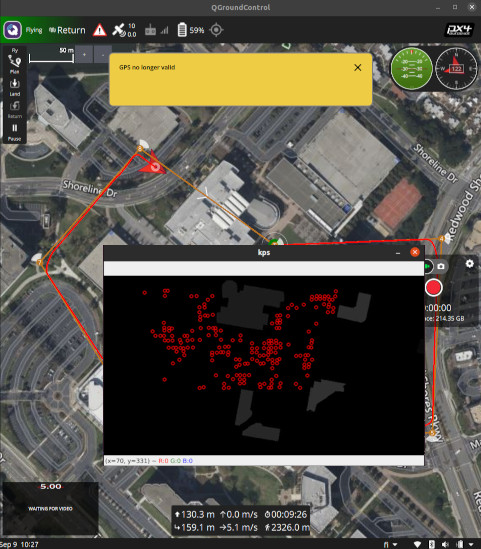

Pose Estimators
====================================================
SuperGlue & LoFTR
____________________________________________________
GISNav comes with adapters for two pose estimators - `SuperGlue`_ and the SuperGlue-inspired `LoFTR`_ - with LoFTR as
the default adapter. They were seen as state-of-the-art image matching neural networks at the time GISNav was
written. However, newer networks may provide better results and you may want to try integrating them with GISNav.

.. _SuperGlue: https://github.com/magicleap/SuperGluePretrainedNetwork
.. _LoFTR: https://github.com/zju3dv/LoFTR

To integrate a new neural network you can either :ref:`Extend PoseEstimator` or
:ref:`Replace PoseEstimationNode` completely.

.. warning::
    * SuperGlue has `restrictive licensing requirements`_, while LoFTR has a `permissive
      license`_.
    * LoFTR uses SuperGlue for *optimal transport* so make sure you use the *dual-softmax* version instead or
      otherwise SuperGlue licensing terms apply.

    .. _restrictive licensing requirements: https://github.com/magicleap/SuperGluePretrainedNetwork/blob/master/LICENSE
    .. _permissive license: https://github.com/zju3dv/LoFTR/blob/master/LICENSE

SITL simulation quirks
^^^^^^^^^^^^^^^^^^^^^^^^^^^^^^^^^^^^^^^^^^^^^^^^^^^^
The `KSQL Airport Gazebo model`_ buildings in the SITL simulation demo are featureless grey blocks, so any
:class:`.PoseEstimator` will most likely not use them for matching. This means any building elevation data (see
:ref:`Rasterizing vector data`) will not technically be used to improve pose estimates in the SITL simulation. The
below figure illustrates how LoFTR finds keypoints at an even density throughout the simulated drone's field of view
except on the featureless buildings.

.. _KSQL Airport Gazebo model: https://docs.px4.io/main/en/simulation/gazebo_worlds.html#ksql-airport

    LoFTR does not find keypoints on featureless buildings or terrain (SITL simulation)

Extend PoseEstimator
____________________________________________________
You must extend the :class:`.PoseEstimator` abstract base class and write your own :meth:`.PoseEstimator.estimate`
method. If your pose estimator is keypoint-based, you may want to extend :class:`.KeypointPoseEstimator` abstract base
class and implement the :meth:`._find_matching_keypoints` method, which will save you the time of estimating the pose
from detected keypoints.

You can use the below snippets to get started with your own :class:`.PoseEstimator` or  :class:`.KeypointPoseEstimator`:

.. tab-set::

    .. tab-item:: Extend PoseEstimator
        :selected:

        .. code-block:: python

            import numpy as np
            from typing import Optional, Tuple
            from gisnav.pose_estimators import PoseEstimator

            class MyPoseEstimator(PoseEstimator):

                def __init__(self):
                    # TODO
                    raise NotImplementedError

                def estimate(self, query: np.ndarray, reference: np.ndarray, k: np.ndarray,
                     guess: Optional[Tuple[np.ndarray, np.ndarray]] = None,
                     elevation_reference: Optional[np.ndarray] = None) -> Optional[Tuple[np.ndarray, np.ndarray]]:
                    """Returns pose between provided images, or None if pose cannot be estimated

                    :param query: The first (query) image for pose estimation
                    :param reference: The second (reference) image for pose estimation
                    :param k: Camera intrinsics matrix of shape (3, 3)
                    :param guess: Optional initial guess for camera pose
                    :param elevation_reference: Optional elevation raster (same size resolution as reference image, grayscale)
                    :return: Pose tuple of rotation (3, 3) and translation (3, 1) numpy arrays, or None if could not estimate
                    """
                    # TODO
                    raise NotImplementedError

        .. note::
            If you can't estimate a pose with the given query and reference frames, you can return ``None`` from your
            :meth:`.PoseEstimator.estimate` method

    .. tab-item:: Extend KeypointPoseEstimator

        .. code-block:: python

            import numpy as np
            from typing import Optional, Tuple
            from gisnav.pose_estimators import KeypointPoseEstimator

            class MyKeypointPoseEstimator(KeypointPoseEstimator):

                def __init__(self):
                    # TODO
                    raise NotImplementedError

                def _find_matching_keypoints(self, query: np.ndarray, reference: np.ndarray) \
                        -> Optional[Tuple[np.ndarray, np.ndarray]]:
                    """Returns matching keypoints between provided query and reference image

                    Note that this method is called by :meth:`.estimate_pose` and should not be used outside the implementing
                    class.

                    :param query: The first (query) image for pose estimation
                    :param reference: The second (reference) image for pose estimation
                    :return: Tuple of matched keypoint arrays for the images, or None if none could be found
                    """
                    raise NotImplementedError

Passing init args to :class:`.PoseEstimator`
^^^^^^^^^^^^^^^^^^^^^^^^^^^^^^^^^^^^^^^^^^^^^^^^^^^^
You need to override the ``pose_estimator_params`` ROS parameter of :class:`.PoseEstimator` with the path to your own
YAML configuration file. See ``launch/params/pose_estimators/`` folder for current examples.

.. note::
    The way this is currently done needs refactoring. See below the relevant section of code in
    :class:`.PoseEstimationNode` initializer:

    .. literalinclude:: ../../../../gisnav/nodes/pose_estimation_node.py
        :caption: :meth:`.PoseEstimationNode.__init__` pose estimator initialization
        :start-after: # region setup pose estimator
        :end-before: # endregion setup pose estimator
        :language: python
        :dedent:

Replace PoseEstimationNode
____________________________________________________
The :ref:`Aircraft GeoPose estimate topics` section describes the topic names and messages the GISNav's
:class:`.MockGPSNode` expects from :class:`.PoseEstimationNode`. You can create your own node that publishes these
messages and :class:`.MockGPSNode` will then be able to use them.

You would have to create your own launch file that strips :class:`.PoseEstimationNode` from the launch description to
prevent the two nodes from publishing their own estimates to the same topic. See :ref:`Launch from ROS launch file` for
more information on launch files.
