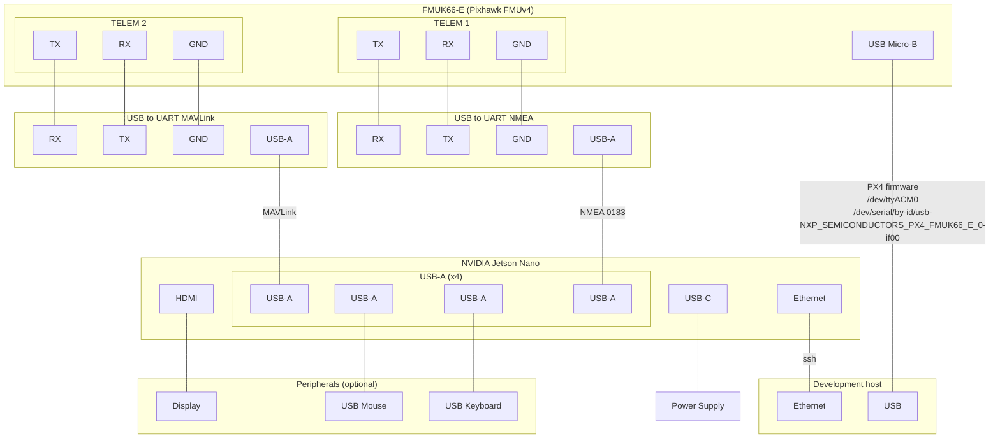

# Pixhawk FMU HIL

<!--@include: ./shared/warning-simulation-use-only.md-->

::: warning Warning: Propellers off
If your autopilot is connected to a vehicle, it is highly recommended to disable the propellers or take other necessary precautions to ensure the vehicle remains grounded.

:::

This page describes how to run HIL simulation on a Pixhawk board and a companion computer.

## Prerequisites

### Simulation host

- Install the GISNav CLI via the [Debian package](/install-from-debian-package).

### Companion computer

- Install the GISNav CLI via the [Debian package](/install-from-debian-package).

### Connectivity & networking

- You need the `ssh` server enabled on your companion computer. Include your own `ssh` public key in the `~/.ssh/authorized_keys` file on the companion computer to ensure you can `ssh` in.

- These instructions assume you are using the hostname `jetsonnano` and that your network stack supports mDNS (`.local` domain). You can edit your companion computer hostname by editing the `/etc/hostname` file.

- Your simulation host and companion computer must be on the same local network. You can e.g. connect them directly with an Ethernet cable. You should share internet connection to your companion computer if you connect directly via Ethernet cable and not e.g. via a router.

#### Connect NVIDIA Jetson Nano and NXP RDDRONE-FMUK66

- We connect our development computer to the Jetson Nano over Ethernet. This is so that we can upload the containers implementing required onboard services.

- This board does not have a `GPS 2` port, so we use the `TELEM 1` port typically reserved for MAVLink communication with GCS for the uORB mock GPS messages.

- We connect the simulation host computer (assumed to be the same as the development computer but strictly speaking these could be separate computers.)



## Upload PX4 firmware

See the [PX4 uploading firmware instructions](https://docs.px4.io/main/en/dev_setup/building_px4.html#uploading-firmware-flashing-the-board) for how to upload your development version of PX4 onto your Pixhawk board (should look something like `make px4_fmu-v4_default upload`) for FMUv4.

To find the `make` target for your specific board, list all options with the `make list_config_targets` command on your development host computer:

```bash
# on development host (not on companion computer)
gnc hil run --no-deps px4 make list_config_targets
```

Then choose your appropriate board for the following examples. We are going to choose `nxp_fmuk66-e_default` for this example:

```bash
# on development host (not on companion computer)
# "hil" command needed here to expose USB device (Pixhawk)
gnc hil run --no-deps -e DONT_RUN=1 px4 make nxp_fmuk66-e_default upload
```

## Build HIL simulation

```bash
# on development host (not on companion computer)
companion_host=jetsonnano.local
GISNAV_COMPANION_HOST=$companion_host gnc hil create --build px4 gisnav@$companion_host
```

## Start HIL simulation

```bash
# on development host (not on companion computer)
companion_host=jetsonnano.local
GISNAV_COMPANION_HOST=$companion_host gnc hil start px4 gisnav@$companion_host
```

::: tip Admin portal
You can also use the [Admin portal](/admin-portal) hosted on the Jetson Nano to see that the Compose services are running.

:::

### Stop simulation

```bash
# In this case we need the "" to also stop on localhost, could also use @localhost
gnc stop "" @jetsonnano.local
```

## QGroundControl

::: tip Restart for changes to take effect
You may have to restart the simulation for some of these changes to take effect. Do not re-create the `qgc` container after making these changes or you will lose your configuration.
:::

After deploying the HIL simulation, adjust the settings via the QGC application as follows:

- Precisely match the `COM_RC_IN_MODE` parameter setting if mentioned in the instructions.
- Ensure that you have HITL enabled in QGC Safety settings.
- You may also need to enable the virtual joystick enabled in QGC General settings to prevent failsafes from triggering.
