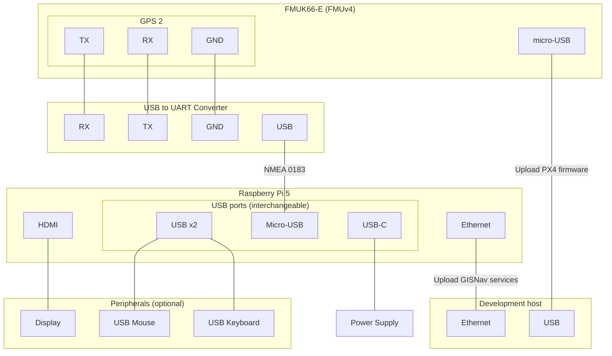

# Raspberry Pi 5 & Pixhawk FMUv4

This page describes how to run HIL simulation on a Pixhawk board using the Raspberry Pi 5 as a companion computer.

## Prerequisites for Raspberry Pi 5

### Docker Compose plugin

<!--@include: ./shared/docker-compose-required.md-->

### systemd

You will also need to have a Linux distro that uses `systemd` such as Debian or any of its derivatives installed on the Raspberry Pi 5.

## Concepts

This page uses the below terminology:

- **Simulation host**: Computer that hosts the HIL simulation world (Gazebo in this case)
- **Development host**: Computer that optionally builds (potentially cross-platform) Docker images and hosts a private Docker registry for the Raspberry Pi 5 companion computer to pull (potentially non-distributable) Docker images from.

## Install GISNav Compose Services

::: info Building your own `.deb`
Instead of installing the `gisnav-compose` Debian package from the public registry, you can also build your own `.deb` file by following [these instructions](/create-debian).

Once you have the `.deb` file built locally or built remotely and moved to the Raspberry Pi 5 (e.g. using `ssh`), you can install `gisnav-compose` using the following command:
```bash
sudo apt-get -y install ./gisnav-compose-*_all.deb

```
:::

Open an `ssh` shell to your Raspberry Pi 5 and use the commands below to install the `gisnav-compose` systemd service from the GISNav Debian repository.

Add the GISNav Debian repository as a trusted repository:

```bash
echo "deb [trusted=yes] https://hmakelin.github.io/gisnav/ ./" | sudo tee /etc/apt/sources.list.d/gisnav.list
```

Add the GPG key of the GISNav Debian repository:

```bash
curl -s https://hmakelin.github.io/gisnav/public.key | sudo apt-key add -
```

Install the `gisnav-compose` Debian package using the below command. The install script will pull and/or build a number of Docker images and can take several hours.

::: tip Private registry
You can make this process quicker by building your own (potentially cross-platform) images on your development host and pulling them onto your Raspberry Pi 5 using a [private registry](/deploy-with-docker-compose#private-registry).

:::

```bash
sudo apt-get update
sudo apt-get -y install gisnav-compose
```

Check that the installation was successful and that the `gisnav-compose` service is running with the following command:

```bash
sudo systemctl status gisnav-compose.service
```

## Uninstall GISNav Compose Services

If you want to uninstall the service, use the below command:
```bash
sudo apt-get remove gisnav-compose
```


## Connect Raspberry Pi 5 and Pixhawk

- We connect our development computer to the Raspberry Pi 5 over Ethernet. This is so that we can upload the containers implementing required onboard services.

- We connect the Raspberry Pi 5 as a secondary NMEA GPS device over the GPS 2 serial port.

- We connect the simulation host computer (assumed to be the same as the development computer but strictly speaking these could be separate computers.)


### Connection diagram


