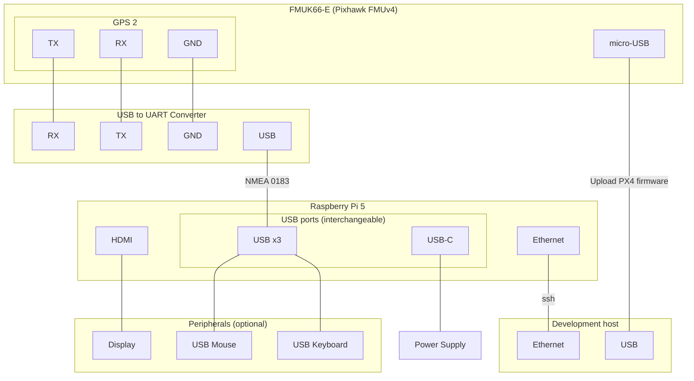

# Raspberry Pi 5 & Pixhawk FMUv4

This page describes how to run HIL simulation on a Pixhawk board using the Raspberry Pi 5 as a companion computer.

## Concepts

This page uses the below terminology:

- **Simulation host**: Computer that hosts the HIL simulation world (Gazebo in this case)
- **Development host**: Computer that optionally builds (potentially cross-platform) Docker images and hosts a private Docker registry for the Raspberry Pi 5 companion computer to pull (potentially non-distributable) Docker images from.

## Prerequisites

### Simulation host

<!--@include: ./shared/clone-to-colcon-workspace.md-->

::: info todo
Instructions to clone only the docker part (e.g. as a submodule).

:::

### Raspberry Pi 5


#### Docker Compose plugin

<!--@include: ./shared/docker-compose-required.md-->

::: tip Install Docker Engine on Debian
Take a look at Docker's [official instructions](https://docs.docker.com/engine/install/debian/) for installing Docker Engine on a Debian-based system.

:::

#### systemd

The Raspberry Pi 5 must be running a Linux distro that uses `systemd` such as Debian or one of its derivatives like Raspberry Pi OS or Ubuntu.

### Connectivity & networking

- You need `ssh` enabled on your Raspberry Pi 5.

- These instructions assume you are using the default hostname `raspberrypi.local` from the `rpi-imager` tool.

- Your development host and Raspberry Pi 5 must be on the same local network. You can e.g. connect them with an Ethernet cable. You may want to share Internet connection to the Raspberry Pi 5 if you want to download the Debian package directly from the Internet onto the Pi.

## Install GISNav Compose Services

::: info Building your own `.deb`
Instead of installing the `gisnav-compose` Debian package from the public registry, you can also build your own `.deb` file by following [these instructions](/create-debian).

Once you have the `.deb` file built locally or built remotely and moved to the Raspberry Pi 5 (e.g. using `ssh`), you can install `gisnav-compose` using the following command:
```bash
sudo apt-get -y install ./gisnav-compose-*_all.deb

```
:::

Open an `ssh` shell to your Raspberry Pi 5:

```bash
ssh raspberrypi.local
```

Download the `gisnav-compose` Debian package and install it using the below commands. You can edit the release string to match your needs.

::: warning Warning: Long build time
The `postinst` script of the Debian package will attempt to pull and build all required Docker images and then create the containers. If the images are not available to be pulled, be prepared for a very long build time.

:::

::: tip Private Docker registry
You can make this process quicker by building your own (potentially cross-platform) images on your development host and pulling them onto your Raspberry Pi 5 using a [private container registry](/deploy-with-docker-compose#private-registry).

:::

```bash
GISNAV_RELEASE=v0.67.0
wget https://github.com/hmakelin/gisnav/releases/download/${GISNAV_RELEASE}/gisnav-compose_${GISNAV_RELEASE}_all.deb -O gisnav-compose_${GISNAV_RELEASE}_all.deb
sudo dpkg -i gisnav-compose_${GISNAV_RELEASE}_all.deb
```

After installing you can fix any missing dependencies using `apt-get`:

```bash
sudo apt-get install -f
```


## Manage GISNav Compose Services

### Start

The `gisnav-compose.service` should start automatically when the system is started. Restart the system or start the `gisnav-compose` service manually to make it active:

```bash
sudo systemctl start gisnav-compose.service
```

The below example shows how you can check that the `gisnav-compose` service is active:

```console
hmakelin@hmakelin-MS-7D48:~$ sudo systemctl status gisnav-compose.service
● gisnav-compose.service - GISNav Docker Compose Services
     Loaded: loaded (/etc/systemd/system/gisnav-compose.service; enabled; vendor preset: enabled)
     Active: active (exited) since Wed 2024-05-15 15:10:21 BST; 3min 35s ago
   Main PID: 241948 (code=exited, status=0/SUCCESS)
        CPU: 354ms

May 15 15:10:18 hmakelin-MS-7D48 docker[241971]:  Container gisnav-mavros-1  Started
May 15 15:10:18 hmakelin-MS-7D48 docker[241971]:  Container gisnav-gscam-1  Started
May 15 15:10:18 hmakelin-MS-7D48 docker[241971]:  Container gisnav-micro-ros-agent-1  Started
May 15 15:10:18 hmakelin-MS-7D48 docker[241971]:  Container gisnav-px4-1  Starting
May 15 15:10:18 hmakelin-MS-7D48 docker[241971]:  Container gisnav-mapserver-1  Started
May 15 15:10:19 hmakelin-MS-7D48 docker[241971]:  Container gisnav-postgres-1  Started
May 15 15:10:20 hmakelin-MS-7D48 docker[241971]:  Container gisnav-px4-1  Started
May 15 15:10:20 hmakelin-MS-7D48 docker[241971]:  Container gisnav-gisnav-1  Starting
May 15 15:10:21 hmakelin-MS-7D48 docker[241971]:  Container gisnav-gisnav-1  Started
May 15 15:10:21 hmakelin-MS-7D48 systemd[1]: Finished GISNav Docker Compose Services.

```

You can also see the service status from the onboard [Admin portal](/admin-portal).

### Stop

You can use the below commands to stop the service (and the related Docker Compose services):
```bash
sudo systemctl stop gisnav-compose.service
```

### Uninstall

If you want to uninstall the service, use the below command:

```bash
sudo apt-get remove gisnav-compose
```


## Connect Raspberry Pi 5 and Pixhawk

- We connect our development computer to the Raspberry Pi 5 over Ethernet. This is so that we can upload the containers implementing required onboard services.

- We connect the Raspberry Pi 5 as a secondary NMEA GPS device over the GPS 2 serial port.

- We connect the simulation host computer (assumed to be the same as the development computer but strictly speaking these could be separate computers.)


### Connection diagram



## Upload PX4 firmware

See the [PX4 uploading firmware instructions](https://docs.px4.io/main/en/dev_setup/building_px4.html#uploading-firmware-flashing-the-board) for how to upload your development version of PX4 onto your Pixhawk board (should look something like `make px4_fmu-v4_default upload`) for FMUv4.

To find the `make` target for your specific board, list all options with the `make list_config_targets` command on your development host computer:

```bash
# on development host (not on Raspberry Pi)
cd ~/colcon_ws/src/gisnav/docker
docker compose -p gisnav run px4 make list_config_targets
```

Then choose your appropriate board for the following examples. We are going to choose `nxp_fmuk66-e_default` for this example:

```bash
# on development host (not on Raspberry Pi)
docker compose -p gisnav run px4 make distclean
docker compose -p gisnav run px4 make nxp_fmuk66-e_default upload
```

## Deploy HIL simulation

### Offboard services

The following steps to deploy the offboard services are based on the [PX4 HIL simulation instructions](https://docs.px4.io/main/en/simulation/hitl.html). The `px4` Docker compose service has a custom `iris_hitl` model and a `hitl_iris_ksql_airport.world` Gazebo world that we are going to use in this example:

::: info TODO
Update the commands below to start the HIL simulation offboard services (need to update override file)

:::

```bash
# on development host (not on Raspberry Pi)
docker compose -p gisnav run -e DONT_RUN=1 px4 make px4_sitl_default gazebo-classic
docker compose -p gisnav run px4 source Tools/simulation/gazebo-classic/setup_gazebo.bash $(pwd) $(pwd)/build/px4_sitl_default
docker compose -p gisnav run px4 gazebo Tools/simulation/gazebo-classic/sitl_gazebo-classic/worlds/hitl_iris_ksql_airport.world

# Important: Start QGroundControl last
docker compose up qgc
```

After deploying the HIL simulation, adjust the settings via the QGC application as follows:

- Precisely match the `COM_RC_IN_MODE` parameter setting if mentioned in the instructions.
- Ensure that you have HITL enabled in QGC Safety settings.
- You may also need to enable the virtual joystick enabled in QGC General settings to prevent failsafes from triggering.

### Onboard services

Ensure that you have started the `gisnav-compose` systemd service:

```bash
# on Raspberry Pi 5
sudo systemctl start gisnav-compose
```

You can also use Docker to check that the GISNav containers are running:

```bash
# on Raspberry Pi 5
# may require sudo depending on how you have setup docker on your Pi
docker ps
```

::: tip Admin portal
You can also use the [Admin portal](/admin-portal) hosted on the Raspberry Pi 5 to see that the core services are running.

:::
