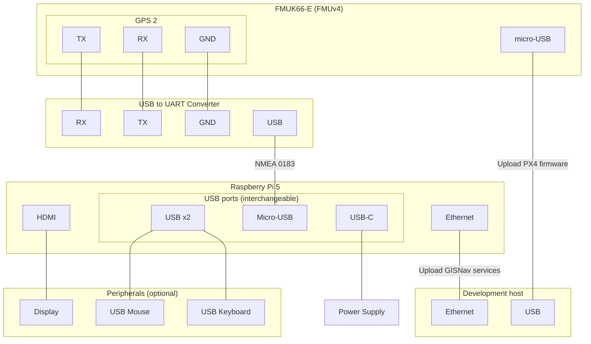

# Raspberry Pi 5 & Pixhawk FMUv4

This page describes how to run HIL simulation on a Pixhawk board using the Raspberry Pi 5 as a companion computer.

### Prerequisites

- [Install GISNav locally](/install-locally)

### Concepts

This page uses the below terminology:

- Simulation host: Computer that hosts the HIL simulation world (Gazebo in this case)
- Development host: Computer that uploads GISNav services onto the companion computer

#### Setup Raspberry Pi 5 board for development

TODO

### Connect Raspberry Pi 5 and Pixhawk

- We connect our development computer to the Raspberry Pi 5 over Ethernet. This is so that we can upload the containers implementing required onboard services.

- We connect the Raspberry Pi 5 as a secondary NMEA GPS device over the GPS 2 serial port.

- We connect the simulation host computer (assumed to be the same as the development computer but strictly speaking these could be separate computers.)

#### Diagram

