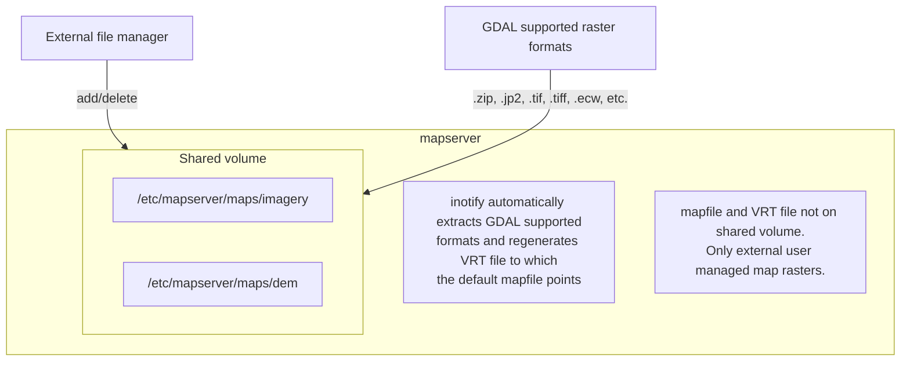

# Setup GIS Server

GISNav requires access to a GIS server that serves high-resolution orthoimagery for the approximate global position of the vehicle. The orthoimagery consisting of orthophotos and optional DEM (Digital Elevation Model) rasters are requested from a WMS (Web Map Service) which allows querying rasters by an arbitrary bounding box, and DEM elevation values by an arbitrary global position via its GetMap requests.

The DEM is optionally used to input ground elevation z-coordinates to the PnP (Perspective-n-Point) problem solved by GISNav's pose estimation algorithm in `PoseNode`. If a DEM is not available, GISNav simply assumes a planar ground elevation, which may be sufficient when flying at higher altitudes where an isometric perspective does not significantly distort the perceived image.

## Example Setups

You are encouraged to self-host an onboard GIS server with public domain orthoimagery because in a realistic scenario, the GIS should be embedded onboard and not depend on an internet connection. For development, it may sometimes be more convenient to proxy an existing commercial tile-based endpoint.

::: info Tile-based endpoints
Commercial web-based map services are often [tile-based](https://wiki.openstreetmap.org/wiki/Slippy_map_tilenames) because it is more efficient to serve pre-rendered tiles than to render unique rasters for each individual requested bounding box. You will need a WMS proxy if you decide to go with a tile-based endpoint.

:::

::: warning: Warning: Caching of map tiles
Many commercial services explicitly prohibit the caching of map tiles in their Terms of Use (ToU), especially if their business model is based on billing API requests. This is mainly to prevent disintermediation in case their tiles are redistributed to a large number of end users.

While caching tiles onboard your own drone is likely not the kind of misuse targeted by such clauses, you should still make sure you understand the ToU of the service you are using and that it fits your planned use case.

:::

If you are fine with using maps for the KSQL airport area only, then you can use the [provided Docker Compose mapserver service](#overview-of-services). See [Managing onboard map rasters](#managing-onboard-map-rasters) for how to add more maps for the mapserver service.

Otherwise, follow these instructions to self-host a MapServer instance:

::: info FOSS GIS software
See [GIS software](#gis-software) for free and open-source software (FOSS) alternatives for MapServer.

:::

To follow these instructions you will need:

- An AWS account and AWS CLI, **or alternatively**, an [EarthExplorer](https://earthexplorer.usgs.gov) account
- GDAL installed

In this example, we will download NAIP imagery and host it using the [MapServer docker image](https://hub.docker.com/r/camptocamp/mapserver) from Docker Hub. You can download the GeoTIFF imagery from EarthExplorer, or from the Esri-maintained [AWS S3 bucket](https://registry.opendata.aws/naip/):

::: warning Warning: Requester pays
This is a **Requester Pays** bucket, and the files can be very large, so download only what you need.

:::

```bash
cd ~/gisnav-docker
mkdir -p mapfiles/
aws s3 cp \
  --request-payer requester \
  s3://naip-source/ca/2020/60cm/rgbir_cog/37122/m_3712230_se_10_060_20200524.tif \
  mapfiles/
```

::: info EROS account required
NAIP imagery is in the public domain. However, you must create an EROS account to download the rasters from EarthExplorer, or use secondary sources such as the AWS S3 bucket mentioned above.

You do not need an account to browse for product IDs with EarthExplorer. An account is only needed if you want to download products.

:::

Once you have the imagery, use GDAL to make a `naip.vrt` VRT file out of your downloaded GeoTIFFs:

```bash
cd mapfiles/
gdalbuildvrt naip.vrt *.tif
```

Once you have your .tif and .vrt files, you can run and host them through a MapServer container:

```bash
export MAPSERVER_PATH=/etc/mapserver
docker run \
  -p 80:80 \
  -v $PWD/mapfiles/:$MAPSERVER_PATH/:ro \
  camptocamp/mapserver
```

Test your MapServer WMS service by opening the capabilities XML in your browser:

```bash
firefox "http://localhost:80/?map=/etc/mapserver/wms.map&service=WMS&request=GetCapabilities"
```

## GIS Software

If you want to run your own GIS server or WMS proxy, you may want to consider these FOSS options:

- MapServer
- [GeoServer](https://geoserver.org) (full-fledged OGC-compliant GIS server

)
- [Mapnik](https://mapnik.org) and [MapProxy](https://mapproxy.org)

## Orthoimagery and DEMs

If you do not want to use commercial (=not free) high-resolution imagery, various national agencies often provide country-specific aerial imagery in the public domain or with public-domain-like licensing terms. You should look for imagery available in GDAL-supported formats with coverage for your flight mission region. These may be provided as downloadable products or through OGC-compliant web services such as WMS or WMTS.

Below are just a few examples of national agencies providing high-resolution orthoimagery that should be suitable for use with GISNav:

- [USGS High Resolution Orthoimagery](https://www.usgs.gov/centers/eros/science/usgs-eros-archive-aerial-photography-high-resolution-orthoimagery-hro) (USA)
- [Environment Agency Vertical Aerial Photography](https://www.data.gov.uk/dataset/4921f8a1-d47e-458b-873b-2a489b1c8165/vertical-aerial-photography) (United Kingdom)
- [NLS orthophotos](https://www.maanmittauslaitos.fi/en/maps-and-spatial-data/expert-users/product-descriptions/orthophotos) (Finland)

::: info Photogrammetry software
If you have a drone, you can also use readily available [photogrammetry](https://en.wikipedia.org/wiki/Photogrammetry) software to create your own maps for your local region of interest.

:::

## Rasterizing Vector Data

In some cases, useful map data is not directly provided in raster but in vector format. The GISNav `mapserver` service uses vector-format elevation data from [OSM Buildings](https://osmbuildings.org/) to determine building heights in the simulation area to improve the accuracy of pose estimates especially at lower flight altitudes where the perceived planarity of the terrain is lower. For an example of how the vector data is rasterized using GDAL, see this [old mapserver service Dockerfile](https://github.com/hmakelin/gisnav/blob/v0.65.0/docker/mapserver/Dockerfile).

::: info Demo quirks
The GISNav SITL demo simulation does not actually benefit from the building height data because the simulated KSQL Airport model buildings are all featureless black blocks. See [SITL simulation quirks](#sitl-simulation-quirks) for more information.

:::

## SITL Simulation Quirks with DEMs

The KSQL Gazebo world buildings in the SITL simulation demo are featureless grey blocks, so any pose estimation model will most likely not use them for matching. This means any building elevation data (see [Rasterizing vector data](#rasterizing-vector-data)) will not technically be used to improve pose estimates in the SITL simulation. The below figure illustrates how LoFTR finds keypoints at an even density throughout the simulated vehicle's field of view except on the featureless buildings.


## Managing Onboard Map Rasters

A shared volume is used to provide a way for external file manager services to add and delete maps onboard. The MapServer static mapfile points to a VRT file which is automatically regenerated whenever a change is detected on the shared volume which contains the source raster files.

A sample FileGator-based `fileserver` service is defined in the `docker/docker-compose.yaml` for managing maps on the shared volume. The application is not necessary - e.g., `scp` could also be used instead.


