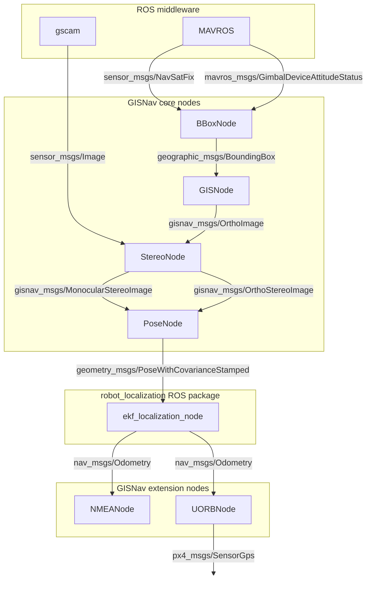
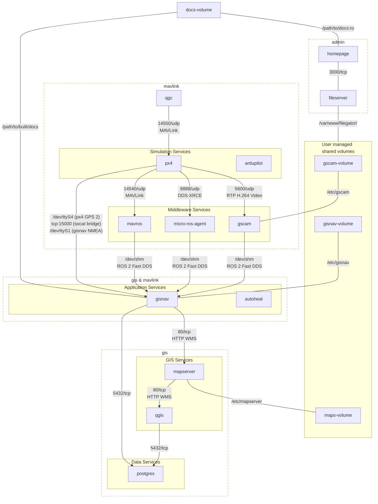

# System architecture

The GISNav ROS 2 package receives upstream inputs from the autopilot via MAVLink and transforms them in multiple sequential steps to downstream outputs, the most important of which are the NMEA mock GPS messages. In GISNav this data processing algorithm is expressed as a distributed unidirectional network of ROS nodes.

The GISNav ROS application also has many external interfaces and effective development requires a simulation environment. GISNav defines and [deploys that simulation environment with Docker Compose](/deploy-with-docker-compose).

This page provides an overview of both the topography of the GISNav ROS 2 package itself as well as how these different Docker Compose services that consitute the simulation environment relate to each other.

## ROS topography

The core ROS topography diagram below depicts how ROS messages flow through GISNav. The [API reference](/api-reference) has more detailed information on the purpose and design of each ROS node.

::: info `MonocularStereoImage` currently disabled
This diagram depicts partially implemented but disabled visual odometry (VO) functionality (`MonocularStereoImage`).
:::

::: info Todo
- From BBoxNode, publish map to `base_link` and `base_link` to `camera` transformations separately to simplify implementation and reduce amount of maintained code.
- Implement REP 105 properly (currently only partially implemented).
- Include default topic names in diagram.
:::

## Service architecture

The `docker/docker-compose.yaml` file defines the Docker Compose services that support GISNav deployments. The diagram below describes the system architecture through the external interfaces between the services.

### Docker build contexts

In the `docker/` folder, you can find a collection of directories roughly corresponding to Docker build contexts, and a number of Docker Compose files defining services that use these build contexts. In case of multi-stage builds, multiple service images can be created from the same build context. The `docker/Makefile` may define additional phony targets for commonly needed tasks such as exposing the X server to containers that have a GUI component.

### Network isolation

Isolation of groups of directly unrelated services is provided by allocating dedicated Docker bridge networks to groups of related services. Docker bridge networks have in-built DNS which means the container names resolve to their respective IP addresses on the bridge networks. The container name will equal the service name prefixed with `gisnav-` and suffixed with `-1`. For example, deploying the `mapserver` service using the Compose file will thereby start a container that can be found by any other container on the same network by its hostname `gisnav-mapserver-1`.

### Shared volumes

Configuration files, orthoimagery and DEM rasters and other data that is intended to be managed by end users are bind-mounted via separate volumes that are exposed to end-user administration tools.

### Service topography

The diagram below depicts the GISNav services topography for SITL simulation that is implemented by Docker Compose.

Some notes on the service topography:

- The Application services `gisnav` and `autoheal` have access to both `gis` and `mavlink` networks.
- The Application services, Simulation services, Middleware services, GIS services, and Data services terms are an attempt to identify and give descriptive names to layers that have naturally emerged in the architecture. They have no further description.
- `socat` could also be considered a middleware service but runs non-containerized on the Docker host so it is not included in the Middleware services in the diagram.
- The deployed topography will slightly vary if Docker Compose overrides are used, for example when deploying for HIL instead of SITL simulation.
- GISnav uses `gscam` to publish the ROS `sensor_msgs.msg.CameraInfo` and `sensor_msgs.msg.Image` messages. The camera topics are not published over the MAVROS middleware.

::: info Todo
- In SITL simulation the serial output from `gisnav` is bridged to `PX4` via TCP on the `mavlink` network so the `mavlink` name is not completely descriptive of the nature of the network (--> change name). With Docker containers, communicating over the network is more convenient and potentially more secure  than trying to bridge the serial communication between `px4` and `gisnav` e.g. via binding Docker host virtual serial ports (pseudo-ttys) to the containers.
- Potentially split `mavlink` network into `mavlink` and `ros` networks. For ROS the intention is to use the shared memory device instead of serializing and going through the network stack since we will be passing a lot of (pointers to) images around.
- `docs-volume` not yet implemented, but is intended to contain static documentation (may need a server).
:::

### Service descriptions

The Homepage labels in the `docker/docker-compose.yaml` file have brief descriptions of the purpose of each individual service. These labels are picked up by the `homepage` service and displayed on the [admin portal](/admin-portal).
