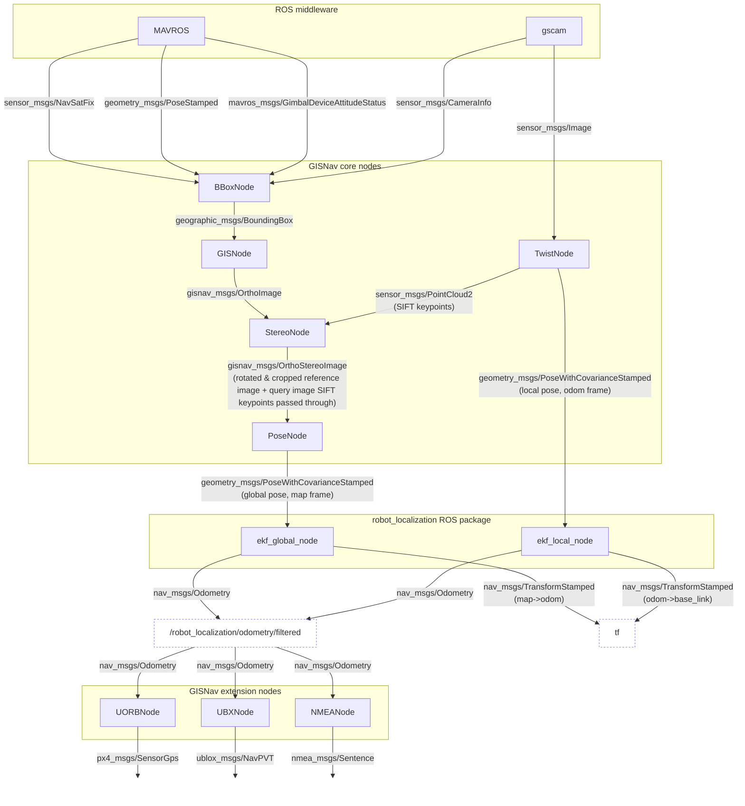
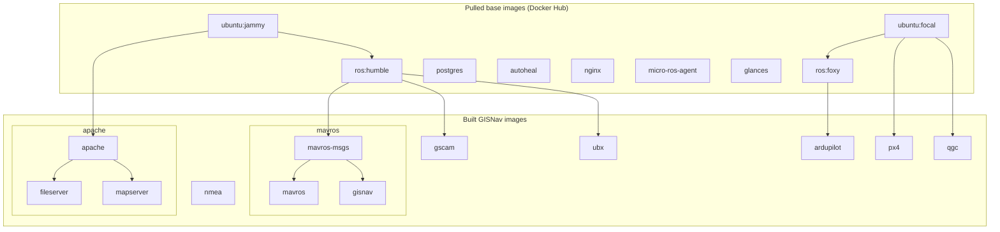
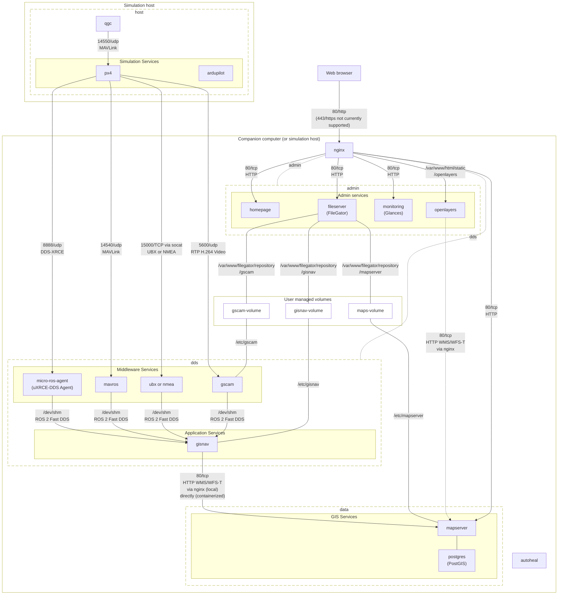

# System architecture

The GISNav ROS 2 package receives upstream inputs from the autopilot via MAVLink and transforms them in multiple sequential steps to downstream outputs, the most important of which are the mock GPS messages. In GISNav this data processing algorithm is expressed as a distributed unidirectional network of ROS nodes.

The GISNav ROS application also has many external interfaces and effective development requires a simulation environment. GISNav defines and [deploys that simulation environment with Docker Compose](/deploy-with-docker-compose).

This page provides an overview of both the topography of the GISNav ROS 2 package itself as well as how these different Docker Compose services that consitute the simulation environment relate to each other.

## ROS topography

The core ROS topography diagram below depicts how ROS messages flow through GISNav. The [API reference](/reference/) has more detailed information on the purpose and design of each ROS node.

## Service architecture

The `docker/docker-compose.yaml` file defines the Docker Compose services that support GISNav deployments. The diagram below describes the system architecture through the external interfaces between the services.

### Docker build contexts

In the `docker/` folder, you can find a collection of directories roughly corresponding to Docker build contexts, and a number of Docker Compose files defining services that use these build contexts. In case of multi-stage builds, multiple service images can be created from the same build context. The `docker/Makefile` may define additional phony targets for commonly needed tasks such as exposing the X server to containers that have a GUI component.

It is important to share layers to keep the overall size of the system down.

::: info Todo
- Update simulation services to use `ubuntu:jammy` and `ros:humble` instead of the older `ubuntu:focal` and `ros:foxy`.
- Ensure we use the same ubuntu base image for `glances` (and not e.g. alpine)
- Update `qgc` from `focal` to `jammy`
:::

### Network isolation

Isolation of groups of directly unrelated services is provided by allocating dedicated Docker bridge networks to groups of related services. Docker bridge networks have in-built DNS which means the container names resolve to their respective IP addresses on the bridge networks. The container name will equal the service name prefixed with `gisnav-` and suffixed with `-1`. For example, deploying the `mapserver` service using the Compose file will thereby start a container that can be found by any other container on the same network by its hostname `gisnav-mapserver-1`.

If a service wants to talk to a service in another network, the requests must go through the `nginx` reverse proxy. Only specific routes are allowed to enable important features - these are shown in the [service topography diagram](#service-topography).

### Shared volumes

Configuration files, orthoimagery and DEM rasters and other data that is intended to be managed by end users are bind-mounted via separate volumes that are exposed to end-user administration tools.

### Service topography

The diagram below depicts the GISNav services topography for SITL simulation that is implemented by Docker Compose.

Some notes on the service topography:

- The Application services, Simulation services, Middleware services, GIS services, and Admin services terms are an attempt to identify and give descriptive names to layers that have naturally emerged in the architecture. They have no further description.
- GISnav uses `gscam` to publish the ROS `sensor_msgs.msg.CameraInfo` and `sensor_msgs.msg.Image` messages. The camera topics are not published over the MAVROS middleware.

::: info Todo
- Serve static documentation.
- Make shared memory transport work. It does not work possibly because of what's described in the note on privileged users [here](https://fast-dds.docs.eprosima.com/en/latest/fastdds/transport/shared_memory/shared_memory.html#segment). A `dds` network is included to allow Fast DDS to communicate via UDP over the network stack instead (`dds` network included in diagram and it includes the `gisnav` service).
- `px4` shares the host network stack (along with `qgc`) because receiving communication from `uxrce_dds_agent` seems to depend on ephemeral ports which makes exposing specific ports difficult (unverified) -> try to isolate the simulator and QGC in a `mavlink` network
- Show `gis` network, which connects `nginx`, `mapserver`, and `gisnav` (not in diagram)
:::

### Service descriptions

The Homepage labels in the `docker/docker-compose.yaml` file have brief descriptions of the purpose of each individual service. These labels are picked up by the `homepage` service and displayed on the [admin portal](/admin-portal).
